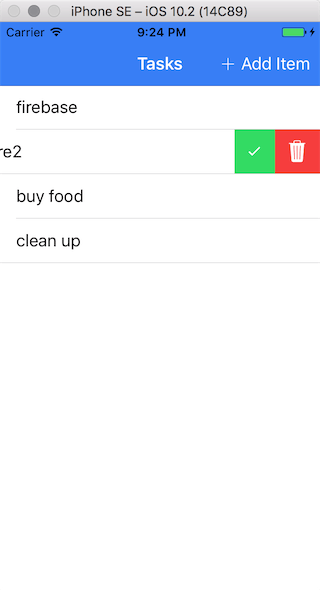

Ionic2Do
===
Mobile App Development with Ionic 2 (~ chapter 7)



## Emulate on iOS

Debugging Details see my blog: https://github.com/uniquejava/blog/issues/42

List available ios targets: 
```bash
ios-sim showdevicetypes
```

Emulate: 
```bash
ionic emulate ios -l -c --target="iPhone-7, 10.2"
ionic emulate ios -l -c --target="iPhone-7-Plus, 10.2"
```
其中-c(--consolelogs)将日志直接打印到terminal, -l(--livereload)支持保存刷新

## List View
```html
<ion-header>
  <ion-navbar color="primary">
    <ion-title>
      Tasks
    </ion-title>
    <ion-buttons end>
      <button ion-button="" icon-left="" (click)="addItem()">
        <ion-icon name="add"></ion-icon>
        Add Item</button>
    </ion-buttons>
  </ion-navbar>
</ion-header>

<ion-content>
  <ion-list>
    <ion-item-sliding #slidingItem *ngFor="let task of tasks">
      <ion-item [ngClass]="{taskDone: task.status === 'done'}">{{task.title}}</ion-item>
      <ion-item-options side="right" (ionSwipe)="removeTask(slidingItem, task)">
        <button ion-button="" icon-only="" (click)="markAsDone(slidingItem, task)" color="secondary">
          <ion-icon name="checkmark"></ion-icon>
        </button>
        <button ion-button="" icon-only expandable="" (click)="removeTask(slidingItem, task)" color="danger">
          <ion-icon name="trash"></ion-icon>
        </button>
      </ion-item-options>
    </ion-item-sliding>

  </ion-list>
</ion-content>

```

### Controller
```js
import { Component } from '@angular/core';

import { NavController, ItemSliding } from 'ionic-angular';

@Component({
  selector: 'page-tasklist',
  templateUrl: 'tasklist.html'
})
export class TaskListPage {
  tasks: Array<any> = [];
  constructor(public navCtrl: NavController) {
    this.tasks = [
      {title: 'Milk', status: 'open'},
      {title: 'Eggs', status: 'open'},
      {title: 'Syrup', status: 'open'},
      {title: 'Pancake Mix', status: 'open'}
    ];
  }

  addItem() {
    let theNewTask: string = prompt('New Task');
    if (theNewTask !== '') {
      this.tasks.push(theNewTask);
    }
  }

  markAsDone(slidingItem: ItemSliding, task: any) {
    task.status = 'done';
    slidingItem.close(); // slide back
  }

  removeTask(slidingItem: ItemSliding, task: any) {
    task.status = 'removed';
    let index = this.tasks.indexOf(task);
    if(index > -1) {
      this.tasks.splice(index, 1);
    }

    slidingItem.close(); // slide back
  }

}

```

### POJO
put task.ts into the same directory with tasklist.ts

```js
export class Task {
  title: string;
  status: string;
}
// ...
import {Task} from './task';

```

change `tasks: Array<any> = [];` ==> `tasks: Array<Task> = [];`.


### Add cordova plugin

From terminal:
```bash
ionic plugin add cordova-plugin-dialogs
```

In controller:
```js
import {Dialogs} from 'ionic-native';
...

addItem() {
  Dialogs.prompt('Add a task', 'Ionic2Do', ['Ok', 'Cancel'], '')
    .then(theResult => {
      if (theResult.buttonIndex == 1 && theResult.input1 !== '') {
        this.tasks.push({title: theResult.input1, status: 'open'});
      }
    });
}
```


## CRUD with firebase

### 1. Apply Firebase account
1)申请: https://firebase.google.com/

2)Firebase是类似mongodb的json db. 设置访问规则Datebase > Rules:
```json
{
  "rules": {
    ".read": "auth == null",
    ".write": "auth == null"
  }
}
```

3)Ionic属于网页应用, 将 Firebase 添加到您的网页应用
以下来自firebase页面: 

复制下方的代码段，将其粘贴到您的 HTML 代码底部，其他 script 标记之前。
```html

<script src="https://www.gstatic.com/firebasejs/3.7.2/firebase.js"></script>
<script>
  // Initialize Firebase
  var config = {
    apiKey: "your-api-key",
    authDomain: "your-authdomain",
    databaseURL: "https://someurl.firebaseio.com",
    storageBucket: "someurl.appspot.com",
    messagingSenderId: "your-messageSenderID"
  };
  firebase.initializeApp(config);
</script>

```

对于ionic只要将这个config对象拷贝出来备用.


4)让typescript识别firebase函数库 (管理d.ts)

这块变化很大 FYI only.

npm install @types/request --save-dev --save-exact

Modify `tsconfig.json`, compileOptions下新增typeRoots和types

```json
    "typeRoots": ["node_modules/@types"],
    "types": ["firebase"]
```


### 2. Install Firebase and AngularFire2
npm install firebase  --save

npm install angularfire2 --save

### 3. Ionic build 系统详解
类似于grunt或gulp, 内置了N多插件

剧烈变化中, 安装最新版:
npm install @ionic/app-scripts@latest
做的事情列表:
12345...n
```bash

ionic build: 加--prod to create an optimized build
ionic clean: 清空www/build目录
ionic copy: src/assets/ + src/index.html ==> www.
```

详见chapter7还有官网:https://github.com/driftyco/ionic-app-scripts

### 3. CRUD

#### Declaration
在app.module.ts:
```js
import {AngularFireModule} from 'angularfire2';
export const firebaseConfig = {
 // ...
}

@NgModule
  imports: [
    IonicModule.forRoot(MyApp),
    AngularFireModule.initializeApp(firebaseConfig)
  ],
```

在tasklist.ts:
```js
import {AngularFire, FirebaseListObservable} from 'angularfire2';

```

### CRUD operations

```js
// make tasks observable
tasks: FirebaseListObservable<any[]>;

// Read
constructor(public navCtrl: NavController, public af: AngularFire) {
  this.tasks = af.database.list('/tasks');
}

// Create: 
this.tasks.push({title: theResult.input1, status: 'open'});

// Update:
this.tasks.update(task.$key, { status: 'done' });

// Delete:
this.tasks.remove(task.$key);
```

### Changes on template (async pipe)

When Ionic/Angular tries to render this template, there isn’t any data defined yet and it will throw an error.
we need to tell Angular that this data will be asynchronously fetched

```html
<ion-item-sliding #slidingItem *ngFor="let task of tasks | async">

```
